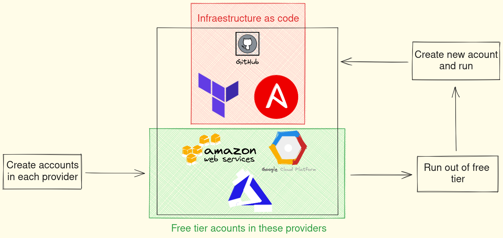
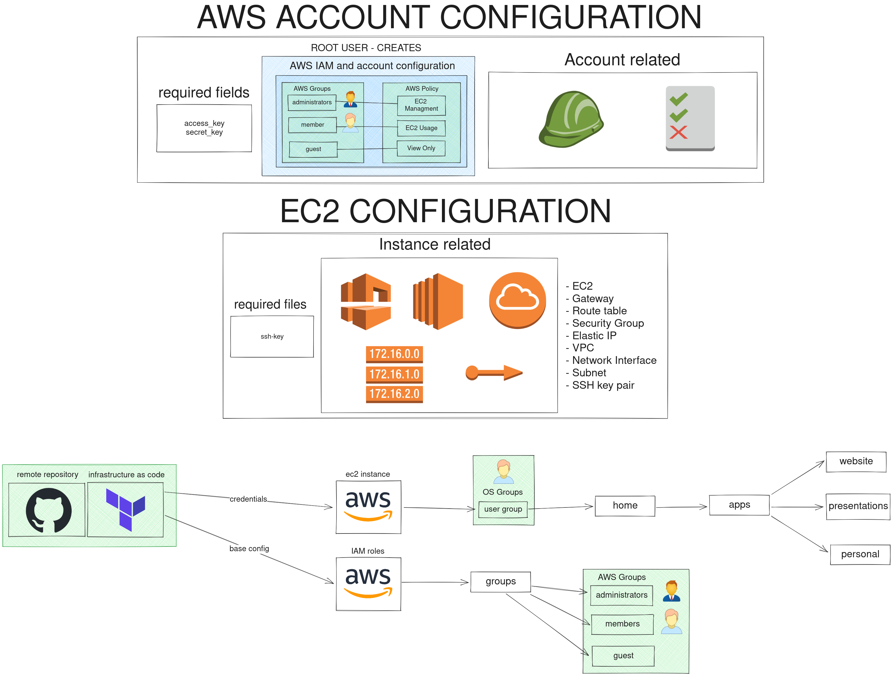

# Club Devops UNLP - Infra ⛅


### Requerimientos 🧰 

- [Terraform](https://www.terraform.io/downloads.html)
- [Ansible](https://docs.ansible.com/ansible/latest/installation_guide/intro_installation.html)
- Un sistema operativo basado en Unix (Linux, MacOS, etc)

### Provedores de nube 🌩

Estos son los provedores de nube que vamos a probar en este repositorio, se va a ir armando la intraestructura en cada uno de ellos. Los archivos de configuracion de cada provedor se encuentran en la carpeta terraform/providers.

- [Amazon Web Services](https://aws.amazon.com/es/) - ✅
- [Microsoft Azure](https://azure.microsoft.com/es-es/) - ✅
- [Digital Ocean](https://www.digitalocean.com/)
- [Oracle Cloud](https://www.oracle.com/cloud/)
- [Google Cloud](https://cloud.google.com/)
- [IBM Cloud](https://www.ibm.com/cloud)

### Que es Terraform? 💜

- Terraform es una herramienta de infraestructura como código (IaC) desarrollada por HashiCorp.
- Terraform puede administrar proveedores de servicio existentes y soluciones de automatización de configuración.
- Permite a los usuarios definir y provisionar una infraestructura de centro de datos mediante un lenguaje de alto nivel.

### Que es Ansible? 🍎

- Ansible es una herramienta de automatización de TI que implementa la administración de configuración, la administración de aplicaciones, la implementación de la plataforma y la orquestación de tareas.
- Ansible se ejecuta en muchos sistemas operativos diferentes, incluidos los sistemas operativos Unix, GNU/Linux y Microsoft Windows.

### Que logramos con este repositorio ❓

1. En este repositorio voy a explicando como levantar una infraestructura en AWS con Terraform y Ansible.
2. Utilizando los free tier podemos alojar nuestra infraestructura sin costo.
3. Una vez terminado nuestro free tier, podemos borrar la infraestructura creada y nos crearemos otra cuenta para seguir utilizando el free tier, ahorrando toda la configuracion manual que se requiere para levantar una infraestructura.
4. Aprendemos sobre infraestructura como codigo, automatizacion y orquestacion de tareas.

### Estructura de carpetas 📁

```
🌳 infra/
┣ 📁 ansible/
┃ ┣ 📁 inventory/
┃ ┃ ┗ 📄 hosts ----> Aca configuramos nuestras maquinas
┃ ┣ 📁 playbooks/ ----> Aca van nuestros playbooks
┃ ┃ ┗ 📄 prepare.yml
┃ ┗ 📄 .gitkeep
┣ 📁 design/
┃ ┣ 📄 Infra_Club_Devops.excalidraw ----> Design de la infra para modificar
┃ ┣ 📄 Infra_Club_Devops.png
┣ 📁 terraform/
┃ ┣ 📁 providers/ ----> Terraform files para diferentes provedores
┃ ┃ ┣ 📄 amazon-aws.tf
┃ ┃ ┣ 📄 digital-ocean.tf
┃ ┃ ┗ 📄 oracle-cloud.tf
┃ ┣ 📁 scripts/
┃ ┃ ┗ 📄 .gitkeep
┃ ┣ 📄 Makefile
┃ ┣ 📄 main.tf
┃ ┣ 📄 secret.tfvars ----> Variables de entorno esto no se sube al repo
┃ ┗ 📄 variables.tf
┣ 📄 .gitignore
┣ 📄 Makefile
┗ 📄 README.md
```

### Como estoy pensando la infraestructura? 🤔

- Work in progress




### Utilizamos variables de entorno ❓

Si, utilizamos variables de entorno para no subir a nuestro repositorio las credenciales de AWS. Esto es una practica de seguridad que se hace en cualquier entorno donde trabajemos con repositorios remotos.

Las siguientes variables en esta tabla son necesarias para la configuración de AWS:

| Variable | Descripción |
| --- | --- |
| access_key | AWS Access Key ID |
| secret_key | AWS Secret Access Key |
| aws_key_pair_public_key | SSH Public Key |
| subscription_id | Azure Subscription ID |
| client_id | Azure Client ID |
| client_secret | Azure Client Secret |
| tenant_id | Azure Tenant ID |
| azure_key_pair_public_key | SSH Public Key |

